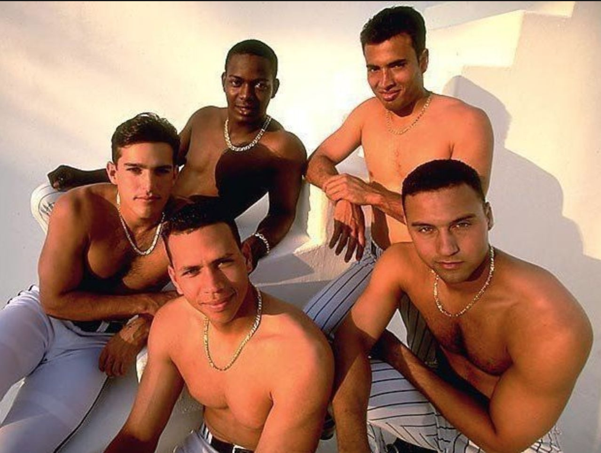
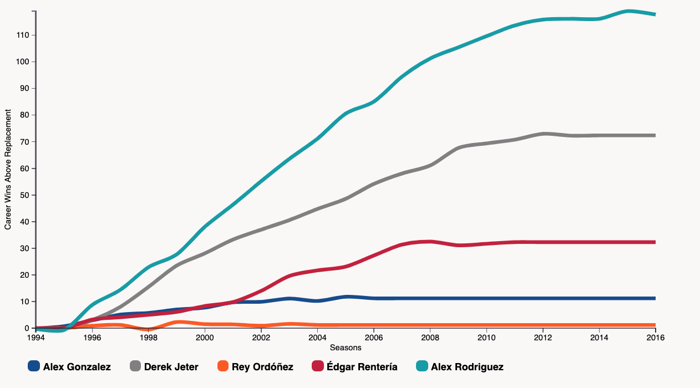

# The Five Shirtless Shortstops

In 1997, as part of Sport Illustrated's work previewing the upcoming MLB season, longtime baseball writer Tom Verducci wrote a piece called, "[Long on Shortstops: The Yankees' Derek Jeter is part of a rich crop of young players who are redefining the position](https://www.si.com/vault/1997/02/24/223063/long-on-shortstops-the-yankees-derek-jeter-is-part-of-a-rich-crop-of-young-players-who-are-redefining-the-position)." In it, Verducci discusses a number of talented young players - Benji Gil! Mark Grudzielanek! - set to make an impact at shortstop before calling out five in particular:

<blockquote>At the head of the class are five others who are already setting standards at the position: Rey Ordóñez, 24, of the New York Mets, an acrobat in spikes; Édgar Rentería, 21, of the Florida Marlins, a .309 hitter last season with more range than Cecilia Bartoli; Alex Gonzalez, 23, of the Toronto Blue Jays, who hit 14 home runs and successfully handled more fielding chances per nine innings than any other regular shortstop in '96; and Rodriguez, 21, and Jeter, 22, the only shortstops who started 140 games and hit .300 or better with at least 10 home runs last season. Those two are the prototypes of the new generation of shortstops.
</blockquote>

Unfortunately for Verducci, the words didn't themselves didn't leave as much of an impression as the beefcake photo that accompanied the piece, as seen above. Over the decade that followed, it became commonplace to see photos from that shoot alongside any number of irreverent blog posts of which one of the pictured players was the subject.

What's most fun to me about a photo like this is to imagine that these five shortstops were once spoken of alongside one another. As even the piece points out at the time, we kind of knew Jeter and A-Rod had the inside track on immmortality, but there was a palpable feeling that a once-in-a-lifetime wave of talent was on its way at a position that had long been associated with glove-first slap hitters.

Of course, with all five players now out of baseball, I was curious what their careers looked like stacked up side by side. To do this, I used their year-by-year Baseball Reference wins above replacement totals plotted on a D3.js responsive multiline chart. [Click here to see the full interactive version of the chart](http://shirtless-shortstops.herokuapp.com/) and drag your mouse over to watch the gaps between the players grow, or view the static version below:

The graph shows how divergent the careers of these five were, representing a broad swath of possible career outcomes for a promising young player. You have the three-time MVP Rodriguez, one of the game's 10 greatest hitters of all-time, in a class by himself at 117.8 WAR, 16th best all-time and more than a Rentería ahead of the five-time World Series champion Jeter (72.4 WAR), the face of baseball for over a decade and a member of the 3,000-hit club. 

At 32.3 WAR, Rentería might not be headed to the Hall of Fame, but he still put together a career that included five All-Star selections, a walk-off hit for the Marlins in Game 7 of the 1997 World Series, and a World Series MVP with the Giants in 2010, more than enough to make him a legend in his native Colombia.

Gonzalez's career (11.2 WAR) was that of a journeyman, playing for six teams in a 13-year career and carving out a reputation as a good glove guy with occasional power, though unfortunately the play he's most known for - a botched double play ball in the 2003 NLCS while with the Cubs - saw his primary skill desert him.

Finally, there's Ordóñez (1.2 WAR), who burst onto the scene with a series of spectacular defensive plays but spent much of his time clinging to an MLB roster due to his anemic bat.

It should be pointed out that A-Rod's WAR is just a hair ahead of the other four shortstops combined, who come in at 117.1. Jeter checks in at 87th all-time, 45.4 WAR behind his former Yankee teammate. The gap between Rodriguez and Jeter is roughly equivalent to the career WARs of some very good players, including Lou Brock, Brad Radke, and Tony Fernandez.

Head over to Baseball Reference to check out the [full MLB career WAR leaderboard](https://www.baseball-reference.com/leaders/WAR_career.shtml).
