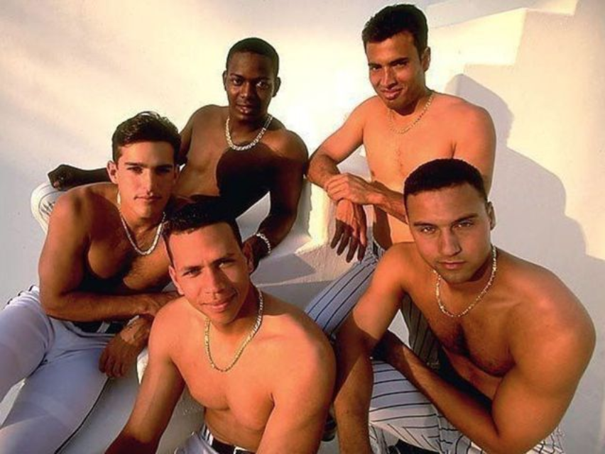

# The Five Shirtless Shortstops

In 1997, as part of Sport Illustrated's work previewing the upcoming MLB season, longtime baseball writer Tom Verducci wrote a piece called, "[Long on Shortstops: The Yankees' Derek Jeter is part of a rich crop of young players who are redefining the position](https://www.si.com/vault/1997/02/24/223063/long-on-shortstops-the-yankees-derek-jeter-is-part-of-a-rich-crop-of-young-players-who-are-redefining-the-position)." In it, Verducci discusses a number of talented young players - Benji Gil! Mark Grudzielanek! - set to make an impact at the position before calling out five in particular:

<blockquote>At the head of the class are five others who are already setting standards at the position: Rey Ordóñez, 24, of the New York Mets, an acrobat in spikes; Édgar Rentería, 21, of the Florida Marlins, a .309 hitter last season with more range than Cecilia Bartoli; Alex Gonzalez, 23, of the Toronto Blue Jays, who hit 14 home runs and successfully handled more fielding chances per nine innings than any other regular shortstop in '96; and Rodriguez, 21, and Jeter, 22, the only shortstops who started 140 games and hit .300 or better with at least 10 home runs last season. Those two are the prototypes of the new generation of shortstops.
</blockquote>

Unfortunately for Verducci, the words didn't themselves didn't leave as much of an impression as the beefcake photo that accompanied the piece, as seen above. Over the decade that followed, it became a commonplace to see photos from that shoot alongside any number of irreverent blog posts of which one of the pictured players was the subject.

What's most fun to me about a photo like this is to imagine that these five shortstops were once spoken of alongside one another. As even the piece points out at the time, we kind of knew Jeter and A-Rod had the inside track on immmortality, but there was a palpable feeling that a once-in-a-lifetime wave of talent was on its way at a position that had long been associated with glove-first slap hitters.

Of course, with all five players now out of baseball, I was curious what their careers looked like stacked up side by side. To do this, I used their year-by-year Baseball Reference wins above replacement totals plotted on a D3.js responsive multiline chart. Here's what it looks line:

